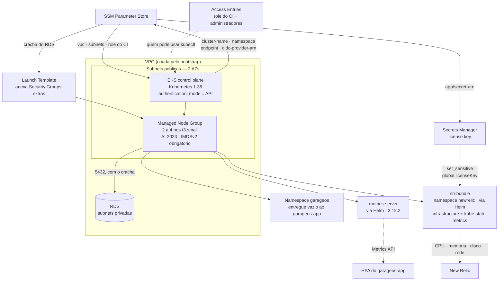

# garageos-infra-k8s

Cluster **Amazon EKS** do GarageOS, provisionado por Terraform: control plane, managed node group, Access Entries, namespace da aplicação, `metrics-server` e o agente do **New Relic**.

> Um dos quatro repositórios do Tech Challenge — Fase 3. Aplicado **depois** do `garageos-infra-database`.

---

## O que este repositório provisiona



| Arquivo | Recursos |
|---|---|
| `cluster.tf` | Cluster EKS, endpoints público e privado, logs de `api` e `authenticator` no CloudWatch |
| `nodes.tf` | Launch Template + managed node group |
| `iam.tf` | Roles do cluster e dos nós, provedor OIDC do cluster (para IRSA) |
| `access-entries.tf` | Quem pode usar `kubectl`: a role do CI e os administradores humanos |
| `namespace.tf` | Namespace `garageos`, entregue vazio |
| `metrics-server.tf` | Helm release do `metrics-server` |
| `newrelic.tf` | Helm release do `nri-bundle` — observabilidade de CPU e memória do cluster |
| `data.tf` | Descoberta da VPC, do crachá do RDS e do segredo com a license key |
| `ssm.tf` | O que este repositório publica para o `garageos-app` |

---

## Decisões que valem conhecer antes de mexer

**Access Entries, não `aws-auth`.** O `authentication_mode = "API"` desabilita por completo o antigo ConfigMap `aws-auth`, editado à mão e famoso por inutilizar clusters quando salvo errado — não havia validação, e um erro de digitação tirava o acesso de todo mundo, sem volta. Com Access Entries, o mapeamento IAM → Kubernetes vira recurso da AWS, versionado no Terraform e validado na criação.

**`bootstrap_cluster_creator_admin_permissions = false`.** Quando ligado, quem cria o cluster ganha um Access Entry *implícito* de administrador — e, como quem cria é o CI, uma entrada explícita para a mesma role falharia com `ResourceInUseException`. Aqui todo acesso é declarado, sem exceção invisível. Por isso a role do CI aparece explicitamente em `access-entries.tf`: sem ela, a própria pipeline não conseguiria aplicar os manifestos depois.

> Para usar `kubectl` da sua máquina, seu ARN precisa estar em `admin_principal_arns` (`variables.tf`). Sem pelo menos um ARN válido ali, **ninguém** acessa o cluster localmente.

**Launch Template para anexar o crachá do RDS.** É a única forma de anexar Security Groups adicionais a um managed node group — e é isso que dá aos pods acesso ao banco. Armadilha conhecida: quando o node group usa Launch Template com `vpc_security_group_ids`, o EKS **deixa de anexar o cluster security group automaticamente**; ele precisa ser listado à mão, senão os nós não falam com o control plane e o node group nunca fica pronto.

**Nós em subnets públicas.** Decisão tomada no bootstrap: sem NAT Gateway (~US$ 32/mês), os nós precisam de rota própria para a internet para baixar imagens e alcançar a API do EKS. Ficam com IP público protegido por Security Group, sem nenhuma porta aberta para `0.0.0.0/0`. Em produção real seriam subnets privadas atrás de NAT.

**`metrics-server` não é opcional.** O HPA lê CPU pela Metrics API, que o Kubernetes não implementa por padrão. Sem ele, o HPA fica com `<unknown>/70%` e nunca escala — o requisito de escalabilidade ficaria apenas declarado no YAML. Ver [ADR 0002](https://github.com/TechChallengeFase1/garageos-app/blob/main/docs/adrs/0002-uso-do-hpa.md).

**O `nri-bundle` sobe pela metade, de propósito.** O agente .NET dentro dos pods já reporta APM, traces e logs da *aplicação*. O que faltava — e o que o enunciado pede — é o outro lado: consumo de CPU e memória do *cluster*. Isso vem do `nri-bundle`, um chart guarda-chuva com vários componentes, dos quais só três ficam ligados:

| Componente | Estado | Motivo |
|---|---|---|
| `infrastructure` | **ligado** | O coletor de CPU, memória, disco e rede de nós, pods e containers |
| `kube-state-metrics` | **ligado** | Traduz Deployment, HPA e Job em métricas — sem ele não há "2 de 4 réplicas prontas" |
| `webhook` | **ligado** | Liga cada transação do APM ao pod e ao nó que a atendeu |
| `logging` | desligado | Os logs já vão pelo agente .NET, com `trace.id` por linha. Duplicaria dado e ingestão |
| `newrelic-pixie`, `pixie-chart` | desligado | Continuous profiling: memória demais para `t3.small` |
| `prometheus`, `nri-kube-events` | desligado | Não há Prometheus para raspar; eventos não são requisito e custam ingestão |

Não é preferência de estilo: cada `t3.small` tem cerca de **1,4 GB alocável** e já opera perto de **56%** só com a aplicação. Ligar o pacote inteiro derrubaria pods por falta de memória. `global.lowDataMode = true` completa a economia do lado da ingestão — sem ele, um cluster pequeno consome a cota de 100 GB/mês do free tier em poucos dias.

**A license key vem do Secrets Manager, não de uma variável do Terraform.** Ela é o único segredo do projeto que não pode ser sorteado: é emitida pela New Relic e identifica a conta de destino. O caminho é o mesmo contrato usado para todo o resto:

```text
bootstrap (-var newrelic_license_key=...)
   └─ Secrets Manager: garageos/app/secrets → newRelicLicenseKey
        ├─ este repositorio: data.aws_ssm_parameter.app_secret_arn
        │     └─ helm_release.newrelic → set_sensitive global.licenseKey
        └─ pipeline do garageos-app → Secret do Kubernetes → agente .NET nos pods
```

O `set_sensitive` mantém o valor fora do plano e do log do apply, e `global.cluster` recebe o nome do cluster na AWS, para as métricas casarem com a entidade certa na interface. Com a chave vazia, o agente sobe e se desliga sozinho, sem afetar o cluster — é o que permite aplicar o ambiente sem configurar observabilidade.

Para conferir os pods do agente depois do apply:

```bash
kubectl get pods -n newrelic
```

**`depends_on` da Access Entry no namespace e no Helm.** O motivo aparece só no `destroy`: o Terraform destrói na ordem inversa da criação e, sem a dependência declarada, pode remover o acesso do CI ao cluster **antes** do namespace — e aí a própria pipeline perde a permissão e falha com `namespaces "garageos" is forbidden`.

---

## Como executar

### Pré-requisitos

- `bootstrap/` e `garageos-infra-database` já aplicados (o `plan` falha com `ParameterNotFound` se faltar algum).
- AWS CLI autenticada, Terraform >= 1.5, `kubectl` a no máximo um *minor* de distância da versão do cluster.

### Deploy automático (caminho normal)

| Gatilho | Ação |
|---|---|
| Pull Request para `homolog` ou `main` | `fmt` + `validate` + `plan`. Nunca aplica |
| Push em `homolog` | `apply` no workspace `homolog` |
| Push em `main` | `apply` no workspace `producao` |
| `workflow_dispatch` | `plan`, `apply` ou **`destroy`** no ambiente escolhido |

Autenticação por **OIDC**, sem credencial estática. Depois do apply, o workflow prova com `kubectl` que o cluster subiu utilizável — nós, namespace, rollout do `metrics-server` e `kubectl top` — em vez de apenas confiar no "created" da API da AWS.

> **Tempo:** criar um cluster EKS leva de 10 a 15 minutos, mais o node group. A execução pode passar de 20 minutos e parecer travada. É normal.

### Execução local

```bash
terraform init
```

```bash
terraform workspace select -or-create producao
```

```bash
terraform apply -var-file=producao.tfvars
```

> **Se o primeiro apply falhar** com `dial tcp 127.0.0.1:80: connect: connection refused`, é porque o Terraform tentou avaliar os providers `kubernetes`/`helm` antes de o cluster existir. Não é erro de configuração — é a limitação conhecida de configurar um provider a partir de recursos do mesmo apply. Crie a base primeiro e rode de novo:
>
> ```bash
> terraform apply -target=aws_eks_node_group.main && terraform apply
> ```

### Acessar o cluster

```bash
aws eks update-kubeconfig --name garageos-producao --region us-east-1
```

```bash
kubectl get nodes -o wide
```

```bash
kubectl top nodes
```

### Destruir ao fim da janela de trabalho

```bash
terraform destroy -var-file=producao.tfvars
```

> **Antes de destruir, remova o Service da aplicação.** O Network Load Balancer foi criado pelo Kubernetes, não pelo Terraform: o `destroy` não o remove, ele fica órfão cobrando (~US$ 18/mês) e, como tem ENIs na VPC, ainda trava a destruição.
>
> ```bash
> kubectl delete svc garageos-api -n garageos
> ```

---

## Custo

| Item | Estimativa ligado 24h |
|---|---|
| Control plane do EKS | ~US$ 73/mês (fixo, com zero ou mil pods) |
| 2× `t3.small` | ~US$ 30/mês |
| **Total** | **~US$ 103/mês ≈ US$ 3,40/dia** |

O `workflow_dispatch` com ação `destroy` existe exatamente para isso: derrubar o ambiente fora das janelas de trabalho.

---

## Capacidade e escalabilidade

| Parâmetro | Valor | Observação |
|---|---|---|
| `node_instance_type` | `t3.small` | Até **11 pods por nó** — limite de ENI, não de memória |
| `node_desired_size` / `min` | 2 | Um nó por AZ |
| `node_max_size` | 4 | Teto para crescimento **manual**: não há Cluster Autoscaler |
| HPA do `garageos-app` | 2–10 réplicas | Escala **pods**, não nós |

Com 2 nós são 22 slots de pod. Ocupam parte deles os componentes de sistema — `coredns`, `aws-node`, `kube-proxy`, `metrics-server` — e o `nri-bundle`, que traz um DaemonSet (um pod por nó) mais `kube-state-metrics` e o `webhook`. O restante fica para as réplicas da aplicação.

A memória é o dimensionamento que manda: cada nó tem ~1,4 GB alocável e opera perto de 56% com a aplicação no ar. Foi essa medição que definiu o conjunto de componentes do `nri-bundle` que ficou ligado. Para acompanhar o consumo em uma janela de trabalho:

```bash
kubectl top nodes
```

```bash
kubectl top pods -A
```

Ampliar a folga — para um teste de carga mais agressivo ou para ligar componentes adicionais do chart — é questão de subir `node_instance_type` para `t3.medium`.

---

## Outputs

```bash
terraform output
```

| Output | O que traz |
|---|---|
| `cluster_name` | Nome do cluster, consumido pela pipeline do `garageos-app` |
| `cluster_endpoint` | Endpoint do API server |
| `cluster_version` | Versão do Kubernetes em execução |
| `namespace` | Namespace onde a aplicação é implantada |
| `node_security_groups` | SGs anexados aos nós, incluindo o crachá do RDS |
| `oidc_provider_arn` | Provedor OIDC do cluster, para roles IRSA |
| `configurar_kubectl` | Comando pronto para acessar o cluster |

---

## Estrutura

```text
garageos-infra-k8s/
├── cluster.tf          # Control plane, access_config, logs
├── nodes.tf            # Launch Template + managed node group
├── iam.tf              # Roles do cluster e dos nós, provedor OIDC (IRSA)
├── access-entries.tf   # Quem pode usar kubectl
├── namespace.tf        # Namespace garageos
├── metrics-server.tf   # Helm release — pré-requisito do HPA
├── newrelic.tf         # Helm release do nri-bundle — CPU e memória do cluster
├── data.tf             # O que lê do bootstrap e do infra-database
├── ssm.tf              # O que publica para o garageos-app
├── homolog.tfvars · producao.tfvars
└── .github/workflows/  # terraform.yml (OIDC, plan/apply/destroy)
```

---

## Documentação relacionada

- [Índice da documentação de arquitetura](https://github.com/TechChallengeFase1/garageos-app/blob/main/docs/README.md)
- [ADR 0002 — Uso do HPA](https://github.com/TechChallengeFase1/garageos-app/blob/main/docs/adrs/0002-uso-do-hpa.md)
- [ADR 0001 — Comunicação entre os repositórios](https://github.com/TechChallengeFase1/garageos-app/blob/main/docs/adrs/0001-comunicacao-entre-repositorios.md)
- [Diagrama de componentes](https://github.com/TechChallengeFase1/garageos-app/blob/main/docs/diagramas/componentes.md)
- **Swagger da API**: `http://<hostname-do-nlb>/swagger` — veja o [README do `garageos-app`](https://github.com/TechChallengeFase1/garageos-app#documentação-da-api-swagger)

## Repositórios da solução

| Repositório | Responsabilidade |
|---|---|
| [`garageos-app`](https://github.com/TechChallengeFase1/garageos-app) | API .NET, manifestos Kubernetes e documentação central |
| [`garageos-infra-database`](https://github.com/TechChallengeFase1/garageos-infra-database) | RDS PostgreSQL e bootstrap da conta |
| **`garageos-infra-k8s`** *(este)* | Cluster EKS |
| [`garageos-lambda-auth`](https://github.com/TechChallengeFase1/garageos-lambda-auth) | Lambda de autenticação e API Gateway |
